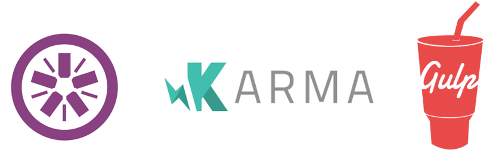

class: center, middle

# JavaScript TDD with <br/> Jasmine, Karma, and Gulp

### All Things Open 2015

### Jason Krol

---

# About Me

.right-image[]

## Jason Krol

<i style="color: #55ACEE;" class="fa fa-twitter"></i> <i class="fa fa-github"></i>  **ShortTompkins**<br/>
<i style="color: orange;" class="fa fa-rss"></i>  Kroltech.com
<br/>

<br/><br/>
Dad, Author, Gamer, Geek!

http://shorttompkins.js.org/jstdd
**github.com/shorttompkins/JSTDD_ATO2015**


---

# Why should we test?

.centered-image[]

* Google is 2 Billion lines of code!<sup>1</sup>
* Acts as a kind of guarantee
* Built-in code documentation!
* Testing can be fun?!

---

# Why we probably aren't

.centered-image[]

Roughly 50% of FE devs aren't testing<sup>2</sup>

* Its time consuming
* It can be tedious and difficult
* Where to start?!

---

# Tools of the Trade

* **Jasmine** (test/assertion library/framework)
 * Others: Mocha, Chai, QUnit, et al
* **Karma** (test runner)
* **Gulp** (task runner)
 * Others: Grunt, Brocolli, npm, make, et al

_Requires node.js and npm installed locally_

.full-image[]

---

# Test Driven Development Crash Course

.full-image[]

---

# Test Driven Development Crash Course

Suites, specs, assertions, spies, mocks, stubs, wtf?!

--

* Describe a piece of code / functionality being tested
--

* Define setup work before and/or after every test
--

* It should do exactly what you expect (all possible scenarios!)
--

* Thats it!
---

## Describe

```javascript
describe('Description/Label', function(){

});
```
 * Typically a single word description/label
 * Can be nested (and very well should be)

---

## beforeEach/afterEach

```javascript
describe('Description/Label', function(){

* beforeEach(function(){
    // do some work before every test
  });

* afterEach(function(){
    // do some cleanup/resets after
  });

});
```

---

## it

```javascript
describe('Description/Label', function(){
  beforeEach(function(){ ... });

* it('should do something...', function(){

  });

* it('should also...', function(){

  });

});
```

---

## expect & matchers

```javascript
describe('Sum', function(){

  it('should sum 2 numbers', function(){
*   expect(sum(1, 1)).toEqual(2);
*   expect(sum(3, 2)).toEqual(5);
*   expect(sum(5, 5)).not.toEqual(99);
  });

});
```

---

## Some common matchers:

* `toBe`, `toEqual`, `toMatch`, `toBeDefined`, `toBeUndefined`
* `toBeTruthy`, `toBeFalsy`
* `toContain`, `toBeGreaterThan`, `toBeLessThan`
* Can be chained with `.not`
  * `not.toBeDefined()`, `not.toEqual(0)`
* Specials:
  * `jasmine.any([Function, Number, String])`
  * `jasmine.anything()`

---

# Spies

.full-image[]

---

# Spies

* `spyOn(object, 'functionToSpyOn')`
* `jasmine.createSpy('nameOfSpy')`<br/><br/>
* Control spy's behavior:
	 * `.and.callThrough()`
	 * `.and.returnValue(newValue)`
	 * `.and.callFake(function(){ ... })`<br/><br/>
* Matchers:
   * `.toHaveBeenCalled()`, `.toHaveBeenCalledWith(params)`

---

## spyOn

```javascript
describe('Sum', function(){
  beforeEach(function() {
*   spyOn(window, 'alert');
  });

  it('should alert the sum', function (){
    sum(1, 1);
*   expect(window.alert)
      .toHaveBeenCalledWith(2);
  });
});
```

---

## jasmine.createSpy

```javascript
describe('window.setTimeout', function(){
  var cbSpy;
  beforeEach(function() {
*   cbSpy = jasmine.createSpy('cbSpy');
    setTimeout(cbSpy, 0);
  });

  it('should execute callback', function (){
*   expect(cbSpy).toHaveBeenCalled();
    expect(cbSpy).calls.count()).toBe(1);
  });
});
```

---

# Create a quick project

```sh
$ mkdir -p jstdd/src/js && cd jstdd
$ touch src/js/sample.js
$ touch src/js/sample_tests.js
```

---

## File contents:

```javascript
// sample.js:
function sum(a, b) {
  window.alert(a + b);
  return a + b;
}
```

---

```javascript
// sample_tests.js:
describe('Sample', function(){
  beforeEach(function () {
    spyOn(window, 'alert');
  });
  it('should sum 2 numbers', function(){
    expect(sum(1,1)).toEqual(2);
  });
  it('should alert the value', function(){
    sum(2, 2);
    expect(window.alert)
      .toHaveBeenCalledWith(4);
  });
});
```

---

# Setup our Dev Environment

First, install Karma's CLI as a global package:

```sh
$ sudo npm install -g karma-cli phantomjs
```
--

Initialize our project:

```sh
$ npm init -y
```

--

Locally install karma for the project:

```sh
$ npm install --save-dev karma
```

---

## Initialize Karma for the project:

```sh
$ karma init
```

* jasmine
* no (Require.js)
* PhantomJS
* `src/js/**/*.js`
* no exclusions
* yes (watch for changes)

---

# Run our first tests!

```sh
*$ karma start
17 09 2015 22:10:09.116:WARN [karma]: No captured browser, open http://localhost:9876/
17 09 2015 22:10:09.128:INFO [karma]: Karma v0.13.9 server started at http://localhost:9876/
17 09 2015 22:10:09.132:INFO [launcher]: Starting browser PhantomJS
17 09 2015 22:10:10.064:INFO [PhantomJS 1.9.8 (Mac OS X 0.0.0)]: Connected on socket ...
PhantomJS 1.9.8: Executed 2 of 2 SUCCESS (0.003 secs / 0.002 secs)
|
```

---

# Introducing Gulp

Why do we need an automated build tool?

.centered-image[]

--

* Bundle/Minify our source code
* Transpile CSS preprocessors like SASS
* ES6 Transpiling (Babel)
* Run tests!!

---

## Install Gulp

First, like Karma, globally install the Gulp CLI:

```sh
$ sudo npm install -g gulp
```

--

Locally install `gulp` and the `gulp-karma` plugin for the project:

```sh
$ npm install --save-dev gulp gulp-karma
```

--

Create a `gulpfile.js`:

```sh
$ touch gulpfile.js
```

---

# Gulpfile.js

```javascript
// gulpfile.js
var gulp = require('gulp'),
    karma = require('gulp-karma');

gulp.task('default', function() {
  gulp.src(['src/js/**/*.js'])
    .pipe(karma({
      configFile: 'karma.conf.js',
      action: 'watch'
    }));
});
```

---

# Run our first Gulp test task!

```sh
*$ gulp
[21:37:43] Using gulpfile ~/repos/jstdd/gulpfile.js
[21:37:43] Starting 'default'...
[21:37:43] Finished 'default' after 8.52 ms
[21:37:43] Starting Karma server...
17 09 2015 21:37:44.077:WARN [karma]: No captured browser, open http://localhost:9876/
17 09 2015 21:37:44.087:INFO [karma]: Karma v0.13.9 server started at http://localhost:9876/
17 09 2015 21:37:44.093:INFO [launcher]: Starting browser PhantomJS
17 09 2015 21:37:45.044:INFO [PhantomJS 1.9.8 (Mac OS X 0.0.0)]: Connected on socket JAj_6NRuzf3kq4w8AAAA with id 32684497
PhantomJS 1.9.8: Executed 2 of 2 SUCCESS (0.003 secs / 0.001 secs)
|
```

---

# Lets look at some real tests!

`VideoPlayer.js` & `VideoPlayer_tests.js`

* Basic video player module
* Uses jQuery
* 12 functions (100 lines)
* 46 tests (over 300 lines)

---

# Resources

* Jasmine Docs: http://jasmine.github.io/
* Karma: http://karma-runner.github.io/
* Gulp: http://gulpjs.com/

## Sources

1. http://www.wired.com/2015/09/google-2-billion-lines-codeand-one-place/
2. http://ashleynolan.co.uk/blog/frontend-tooling-survey-2015-results

---
class: center, middle

# Start Testing!!

.full-image[]
